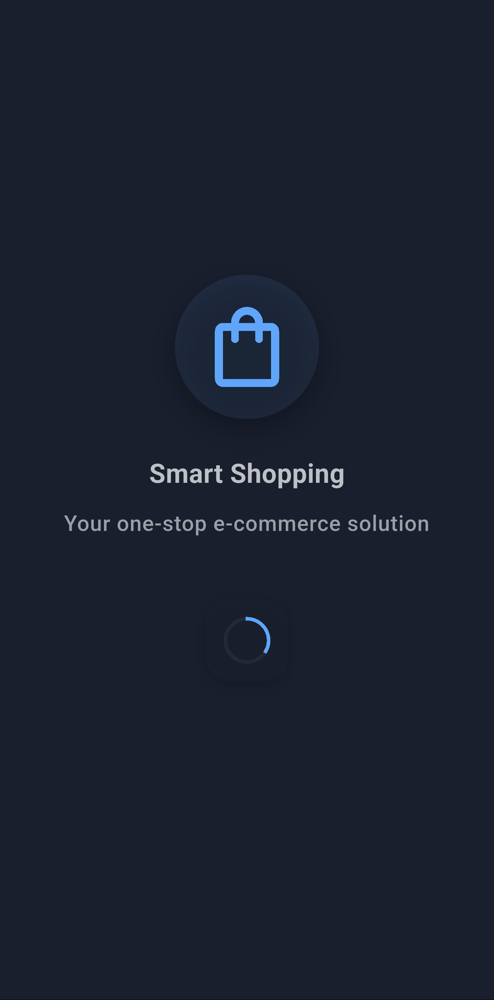

# E-Commerce Flutter App

A modern, feature-rich e-commerce mobile application built with Flutter, implementing clean architecture principles and modern Flutter development practices.

## 🚀 Features

### Core Functionality
- **Product Browsing**: Browse products with infinite scroll pagination
- **Search & Filter**: Real-time search and category-based filtering
- **Product Details**: Comprehensive product information with image gallery
- **Shopping Cart**: Add, update, and manage cart items
- **Wishlist**: Save favorite products for later
- **User Authentication**: Firebase-based email/password authentication
- **Theme Support**: Dynamic light/dark theme switching
- **Offline Support**: Local caching with Hive for offline browsing

### User Experience
- **Responsive Design**: Optimized for various screen sizes
- **Material 3 Design**: Modern UI following Material Design 3 guidelines
- **Smooth Animations**: Enhanced user experience with fluid transitions
- **Pull-to-Refresh**: Easy content refreshing across screens
- **Loading States**: Shimmer effects and loading indicators
- **Error Handling**: Comprehensive error handling with user-friendly messages

## 📱 Screenshots & Demo

### App Screenshots
Experience the app in both Light and Dark themes:

#### 🌅 Splash & Authentication
<table>
  <tr>
    <td align="center">
      
      <br>
      <sub><b>Splash (Light)</b></sub>
    </td>
    <td align="center">
      
      <br>
      <sub><b>Splash (Dark)</b></sub>
    </td>
    <td align="center">
      
      <br>
      <sub><b>Login (Light)</b></sub>
    </td>
    <td align="center">
      
      <br>
      <sub><b>Login (Dark)</b></sub>
    </td>
  </tr>
</table>

#### 🏠 Home & Product Browsing
<table>
  <tr>
    <td align="center">
      
      <br>
      <sub><b>Home (Light)</b></sub>
    </td>
    <td align="center">
      
      <br>
      <sub><b>Home (Dark)</b></sub>
    </td>
    <td align="center">
      
      <br>
      <sub><b>Product Details (Light)</b></sub>
    </td>
    <td align="center">
      
      <br>
      <sub><b>Product Details (Dark)</b></sub>
    </td>
  </tr>
</table>

#### 🛒 Shopping & Wishlist
<table>
  <tr>
    <td align="center">
      
      <br>
      <sub><b>Shopping Cart (Light)</b></sub>
    </td>
    <td align="center">
      
      <br>
      <sub><b>Shopping Cart (Dark)</b></sub>
    </td>
    <td align="center">
      
      <br>
      <sub><b>Wishlist (Light)</b></sub>
    </td>
    <td align="center">
      
      <br>
      <sub><b>Wishlist (Dark)</b></sub>
    </td>
  </tr>
</table>

#### 👤 Profile Management
<table>
  <tr>
    <td align="center">
      
      <br>
      <sub><b>Profile (Light)</b></sub>
    </td>
    <td align="center">
      
      <br>
      <sub><b>Profile (Dark)</b></sub>
    </td>
  </tr>
</table>

## 🏗️ Architecture & Technical Implementation

### Clean Architecture
The application follows **Clean Architecture** principles with clear separation of concerns:

```
lib/
├── core/                    # Shared utilities and base classes
│   ├── errors/             # Custom exception handling
│   ├── helpers/            # UI helpers (spacing, utilities)
│   ├── network/            # Network connectivity management
│   ├── services/           # External services (Hive, Firebase)
│   ├── theme/              # App theming and styling
│   └── utils/              # General utilities and extensions
├── features/               # Feature-based modules
│   ├── auth/              # Authentication feature
│   ├── cart/              # Shopping cart feature
│   ├── home/              # Home/main navigation
│   ├── product/           # Product browsing and details
│   ├── profile/           # User profile management
│   └── wishlist/          # Wishlist feature
└── routes/                # Navigation and routing
```

### Each feature follows the layered architecture pattern:
- **Presentation Layer**: UI components, BLoC state management, pages, widgets
- **Domain Layer**: Business logic, entities, use cases, repository interfaces
- **Data Layer**: Repository implementations, data sources, models

### State Management
- **BLoC Pattern**: Implemented using `flutter_bloc` for predictable state management
- **Event-Driven Architecture**: All user interactions trigger events that update application state
- **Reactive Programming**: Streams and reactive patterns for real-time updates

### Key Design Patterns
- **Repository Pattern**: Abstracts data sources from business logic
- **Use Case Pattern**: Encapsulates specific business operations
- **Dependency Injection**: Using `flutter_bloc`'s `RepositoryProvider` and `MultiBlocProvider`
- **Observer Pattern**: BLoC for state observation and UI updates

## 📦 Key Dependencies

### Core Framework
- **flutter**: ^3.0.0 - UI framework
- **dart**: >=3.0.0 - Programming language

### State Management
- **flutter_bloc**: ^9.1.1 - BLoC pattern implementation
- **bloc**: ^9.0.0 - Core BLoC library
- **equatable**: ^2.0.7 - Value equality comparisons

### Navigation & Routing
- **flutter_modular**: ^6.4.1 - Declarative routing and navigation

### Data & Storage
- **hive**: ^2.2.3 - Local NoSQL database
- **hive_flutter**: ^1.1.0 - Hive Flutter integration
- **shared_preferences**: ^2.5.3 - Key-value storage
- **path_provider**: ^2.1.5 - File system paths

### Network & Authentication
- **dio**: ^5.9.0 - HTTP client
- **firebase_core**: ^4.1.0 - Firebase initialization
- **firebase_auth**: ^6.0.2 - Firebase authentication
- **connectivity_plus**: ^7.0.0 - Network connectivity checking

### UI & UX
- **adaptive_theme**: ^3.7.1+2 - Dynamic theme switching
- **cached_network_image**: ^3.3.1 - Network image caching
- **shimmer**: ^3.0.0 - Loading shimmer effects

### Development & Testing
- **flutter_lints**: ^5.0.0 - Dart/Flutter linting rules
- **bloc_test**: ^10.0.0 - BLoC testing utilities
- **mocktail**: ^1.0.4 - Mocking framework
- **build_runner**: ^2.4.7 - Code generation
- **hive_generator**: ^2.0.1 - Hive model generation

## 🚀 Setup Instructions

### Prerequisites
- **Flutter SDK**: Version 3.0.0 or higher
- **Dart SDK**: Version 3.0.0 or higher
- **Android Studio** or **VS Code** with Flutter extensions
- **Git** for version control

### Development Environment Setup

1. **Clone the Repository**
   ```bash
   git clone https://github.com/ferrykurniawan28/e_commerce.git
   cd e_commerce
   ```

2. **Install Dependencies**
   ```bash
   flutter pub get
   ```

3. **Generate Required Files**
   ```bash
   flutter packages pub run build_runner build
   ```

4. **Firebase Setup**
   
   The app is configured to use Firebase for authentication. Firebase configuration files are included:
   - `android/app/google-services.json`
   - `ios/Runner/GoogleService-Info.plist`
   - `lib/firebase_options.dart`

   **Note**: For production deployment, you should:
   - Create your own Firebase project at [Firebase Console](https://console.firebase.google.com/)
   - Enable Authentication with Email/Password provider
   - Replace the configuration files with your own
   - Update `lib/firebase_options.dart` with your project credentials

5. **Run the Application**
   ```bash
   # Run in debug mode
   flutter run
   
   # Run in release mode
   flutter run --release
   
   # Run on specific device
   flutter run -d <device_id>
   ```

6. **Build for Production**
   ```bash
   # Android APK
   flutter build apk --release
   
   # Android App Bundle (recommended for Play Store)
   flutter build appbundle --release
   
   # iOS (requires Xcode and Apple Developer account)
   flutter build ios --release
   ```

### Development Commands

```bash
# Run tests
flutter test

# Run static analysis
flutter analyze

# Format code
flutter format .

# Check outdated dependencies
flutter pub outdated

# Clean build files
flutter clean && flutter pub get
```

## 🏛️ Architecture Decisions

### 1. Clean Architecture Implementation

**Decision**: Implement Clean Architecture with clear layer separation

**Rationale**:
- **Maintainability**: Clear separation makes code easier to understand and modify
- **Testability**: Each layer can be tested independently
- **Scalability**: New features can be added without affecting existing code
- **Team Collaboration**: Multiple developers can work on different layers simultaneously

**Implementation**:
- **Domain Layer**: Contains business logic, entities, and use cases
- **Data Layer**: Handles data sources (API, local storage) and repository implementations
- **Presentation Layer**: UI components and state management

### 2. BLoC Pattern for State Management

**Decision**: Use BLoC (Business Logic Component) pattern with flutter_bloc

**Rationale**:
- **Predictable State**: Unidirectional data flow makes state changes predictable
- **Separation of Concerns**: Business logic is separated from UI components
- **Testing**: BLoC components are easily testable in isolation
- **Performance**: Efficient rebuilds with selective widget updates
- **Debugging**: Time-travel debugging and clear state transitions

**Implementation**:
- Each feature has its own BLoC for state management
- Events trigger state changes through pure functions
- UI components listen to state changes and rebuild accordingly

### 3. Feature-Based Modular Architecture

**Decision**: Organize code by features rather than by technical layers

**Rationale**:
- **Scalability**: Easy to add new features without affecting existing ones
- **Team Structure**: Teams can own complete features end-to-end
- **Code Reuse**: Shared utilities in core module
- **Deployment**: Potential for feature-based deployments in the future

**Structure**:
```
features/
├── auth/           # Complete authentication feature
├── product/        # Product browsing and details
├── cart/           # Shopping cart functionality
├── wishlist/       # Wishlist management
└── profile/        # User profile features
```

### 4. Repository Pattern with Multiple Data Sources

**Decision**: Implement Repository pattern with both remote (API) and local (Hive) data sources

**Rationale**:
- **Offline Support**: Users can browse cached content without internet
- **Performance**: Local caching reduces API calls and improves response times
- **Data Consistency**: Single source of truth through repository abstraction
- **Flexibility**: Easy to switch between data sources based on connectivity

**Implementation**:
- Repositories check network connectivity
- Prioritize remote data when available
- Fall back to cached data when offline
- Implement cache strategies for different data types

### 5. Dependency Injection with Flutter BLoC

**Decision**: Use `flutter_bloc`'s built-in dependency injection with `RepositoryProvider` and `MultiBlocProvider`

**Rationale**:
- **Testability**: Easy to mock repositories and use cases for testing BLoCs
- **Loose Coupling**: BLoCs depend on repository interfaces, not implementations
- **Integration**: Perfect integration with BLoC state management
- **Simplicity**: No additional DI framework needed when using BLoC pattern

**Implementation**:
- `MultiRepositoryProvider` manages all repository dependencies
- `MultiBlocProvider` creates BLoCs with injected dependencies
- Each BLoC receives its required use cases through constructor injection
- Repositories are injected into use cases at creation time

### 6. Firebase for Authentication

**Decision**: Use Firebase Authentication for user management

**Rationale**:
- **Security**: Industry-standard security practices built-in
- **Reliability**: Google's infrastructure ensures high availability
- **Features**: Comprehensive authentication methods
- **Integration**: Excellent Flutter integration with official packages
- **Scalability**: Handles user growth automatically

**Implementation**:
- Email/password authentication
- User state management through streams
- Token-based API authentication (ready for implementation)

### 7. Hive for Local Storage

**Decision**: Use Hive for local data persistence

**Rationale**:
- **Performance**: Fast read/write operations
- **Type Safety**: Code generation for type-safe operations
- **Size**: Lightweight database solution
- **Flutter Integration**: Excellent Flutter compatibility
- **No SQL**: Simple key-value and box-based storage

**Implementation**:
- Separate boxes for different data types (products, cart, wishlist)
- Model classes with Hive type adapters
- Automatic cache management with expiration strategies

### 8. Material Design 3 with Adaptive Theming

**Decision**: Implement Material Design 3 with dynamic light/dark theme switching

**Rationale**:
- **User Experience**: Modern, consistent design language
- **Accessibility**: Built-in accessibility features
- **Customization**: Extensive theming capabilities
- **Platform Integration**: Follows platform conventions
- **Future-Proof**: Latest design system from Google

**Implementation**:
- Dynamic color schemes based on system preferences
- Custom theme definitions for brand consistency
- Adaptive components that respond to theme changes
- Consistent spacing and typography systems

## 🧪 Testing Strategy

The app includes comprehensive testing at multiple levels:

### Unit Tests
- **Use Cases**: Business logic validation
- **Repositories**: Data layer testing with mocked dependencies
- **BLoCs**: State management testing with bloc_test

### Widget Tests
- **Components**: Individual widget behavior
- **Pages**: User interaction flows
- **Integration**: Widget interaction with BLoCs

### Test Structure
```
test/
├── auth/
│   ├── data/
│   ├── domain/
│   └── presentation/
├── product/
├── cart/
└── wishlist/
```

<!-- ## 📱 Supported Platforms

- **Android**: API level 21+ (Android 5.0+)
- **iOS**: iOS 11.0+
- **Web**: Modern browsers (planned)
- **Desktop**: Windows, macOS, Linux (future consideration) -->

<!-- ## 🔮 Future Enhancements

### Planned Features
- **Payment Integration**: Stripe, PayPal integration
- **Order Management**: Order history and tracking
- **Push Notifications**: Order updates and promotions
- **Social Authentication**: Google, Facebook login
- **Product Reviews**: User reviews and ratings
- **Advanced Search**: Filters, sorting, price ranges
- **Multi-language**: Internationalization support

### Technical Improvements
- **Analytics**: Firebase Analytics integration
- **Performance**: Image optimization and caching strategies
- **Security**: API security enhancements
- **CI/CD**: Automated testing and deployment pipelines
- **Monitoring**: Crash reporting and performance monitoring -->

## 🤝 Contributing

1. Fork the repository
2. Create a feature branch (`git checkout -b feature/amazing-feature`)
3. Follow the existing code style and architecture patterns
4. Add tests for new features
5. Commit changes (`git commit -m 'Add amazing feature'`)
6. Push to the branch (`git push origin feature/amazing-feature`)
7. Open a Pull Request
<!-- 
## 📄 License

This project is licensed under the MIT License - see the [LICENSE](LICENSE) file for details. -->

## 👨‍💻 Author

**Ferry Kurniawan**
- GitHub: [@ferrykurniawan28](https://github.com/ferrykurniawan28)
